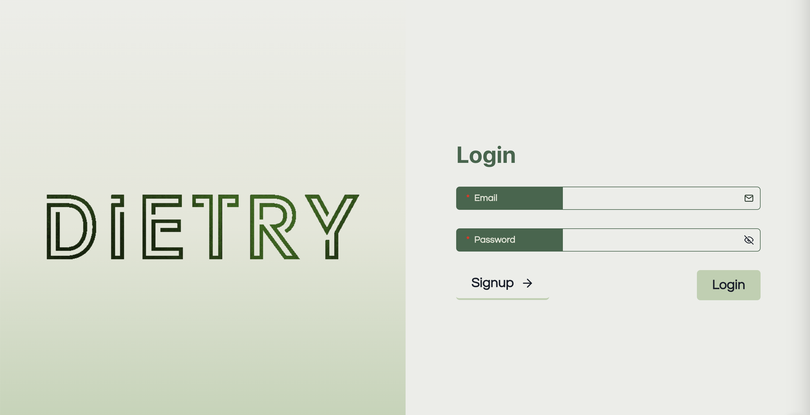
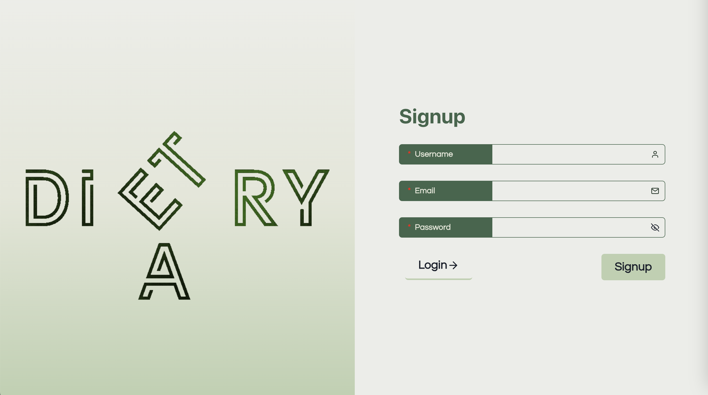
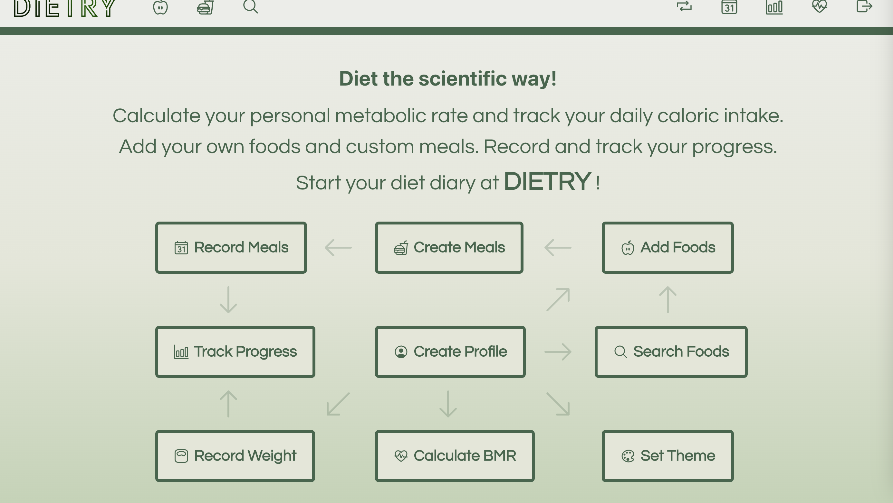
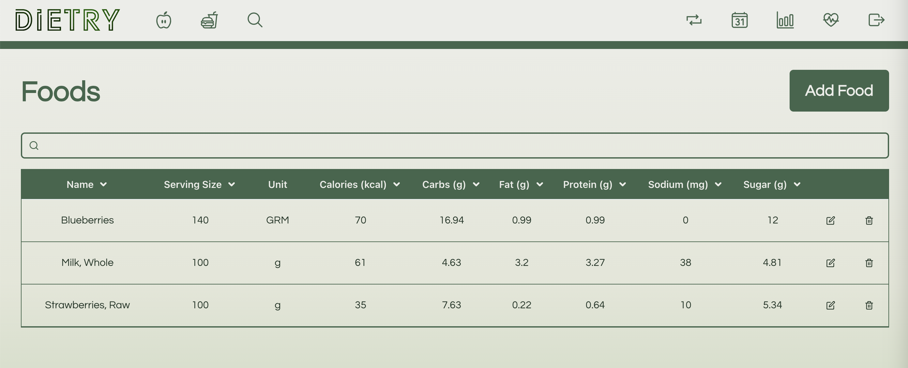
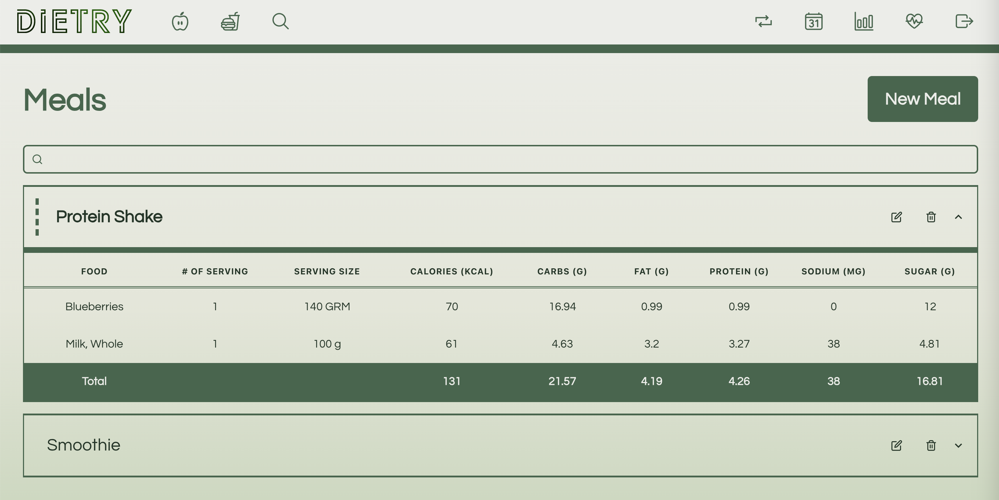
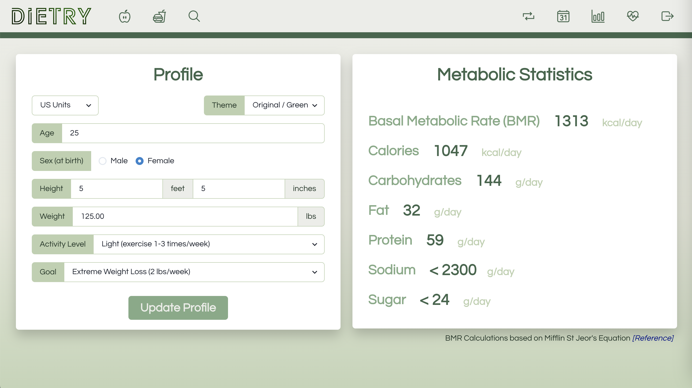
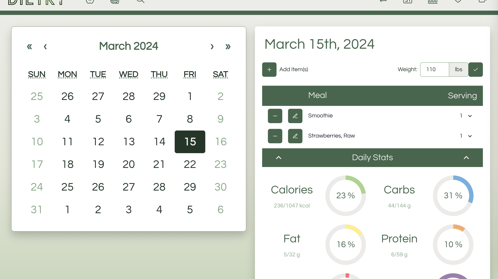
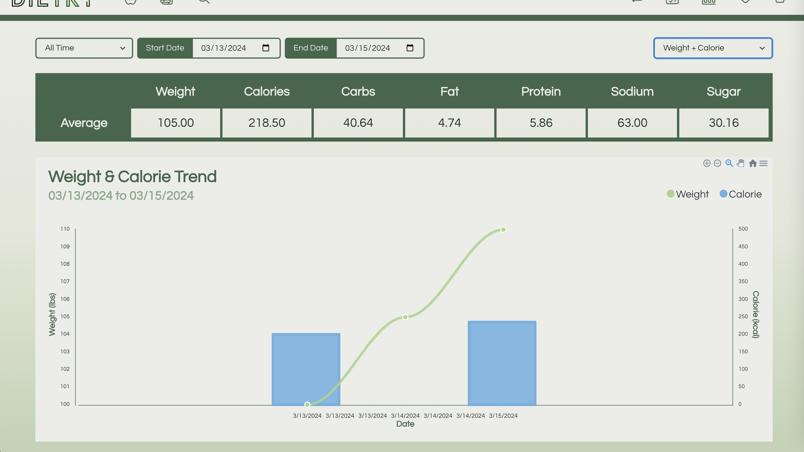
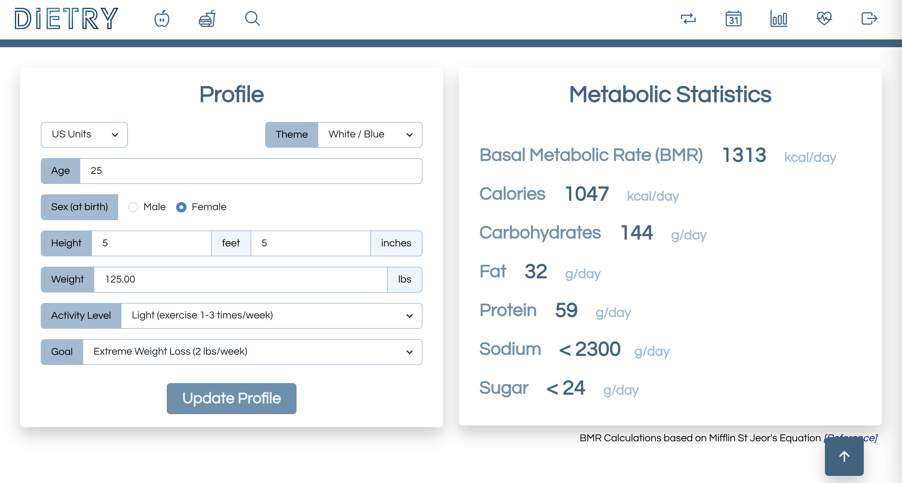
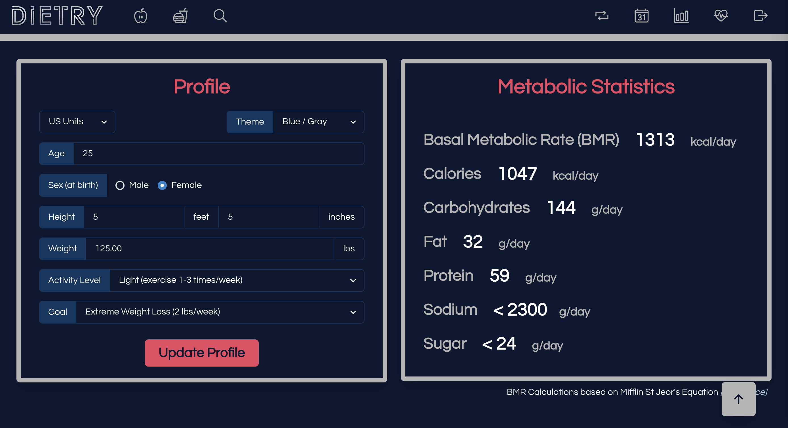

# Dietry - Track meals and weight for dieting

**Application Link:** [Dietry](https://dietry.onrender.com)
>**Note**: When creating an account, must have a valid, unique email and password must be at least 5 characters in length.

**View:** [Table of Content](#table-of-content) / [Creator Notes](#creator-notes) / [Application Pages Preview](#application-pages-preview)

**Application Preview:**
-
*Web Version*

*Mobile Version*

---

## **TABLE OF CONTENT**

* [Descripton](#description)

* [Installation Instructions](#installation-instructions)

* [Usage Information](#usage-information)

* [App License](#app-license)

* [Contribution Guidelines](#contribution-guidelines)

* [Questions](#questions)

* [API Attributions](#api-attributions)

---

## Description

> *Dietry* is a site designed to let users keep track of their meals and weight to accomplish any diet goals. With the application, you can create a profile to calculate macronutritions based on workout activity level and weight goal. 
   
> Users can add their own unique foods and build unique meals to add to their diet log. They can track their daily caloric intake on an interactive calendar.
>
> The site's interface is fun and interactive so users can enjoy the process of viewing and creating meal plans. Application available on both mobile and web interface.
>
> Users can create view their diet process, weight and macronutrions, visually on graphs. Specific date ranges can be selected for a more percise breakdown.
>
> Users can search for different foods to find its nutrients level (data fetched from USDA Food Data Central) and easily add the food to their own account.
>
> Users can convert weight and engeries between different units, making it easier to track the food consumed.

---

## Installation Instructions 

> To run locally, simply use 'npm install', then 'npm run develop'. Otherwise, access/view live on Render at - [Dietry](https://dietry.onrender.com).

---

## Usage Information 

> To start, head to the URL provided above. 
>
> Next, head to "Login / Sign up" and create a new account or sign into your existing one.
>
> From there, create a profile and start adding foods and creating meals!

---

## App License 

> This app is covered under the following license: None

---

## Contribution Guidelines 

> Application not accepting direct contribution.
> However, any feedback is welcomed to be sent to the contacts below.

---

## Questions 

> For more information and questions, please contact me at:
> <fannychen623@gmail.com> [(GitHub)](https://github.com/fannychen623)

## API Attributions
> [USDA Food Data Central](https://fdc.nal.usda.gov/index.html)

---

## **CREATOR NOTES**

### **My Task**
* Create the application from scratch. 

* Use React and Chakra.js as a template engine.
   > CSS Framework Used: [Chakra.js](https://chakra-ui.com/)
   > Have polished and responsive UI.

* Get API keys and connect to a server-side API.
   > API Used: [USDA Food Data Central](https://fdc.nal.usda.gov/api-guide.html)

* Use Node.js and Express.js to create a RESTful API.

* Include authentication (express-session, cookies, JWT).
   > Used bycrypt to protect user data.

* Use GraphQL, MongoDB, and Mongoose for the database.
   > Connect to server and use typedefs and resolvers to perform CRUD Operations.

* Use dotenv to protect API keys and sensitive information with environment variables

* Use Apollo Client and Server to create dynamic front-end / back-end integration.

* Organize folder structure to meet Client-Server paradigm. 

## **APPLICATION PAGES PREVIEW**
### Login Page
>
### Signup Page
>
### Home Page
>
### Foods Page
>
### Meals Page
>
### Profile Page
>
### Calendar Page
>
### Progress Page
>
### Sample Theme 1
>
### Sample Theme 2
>